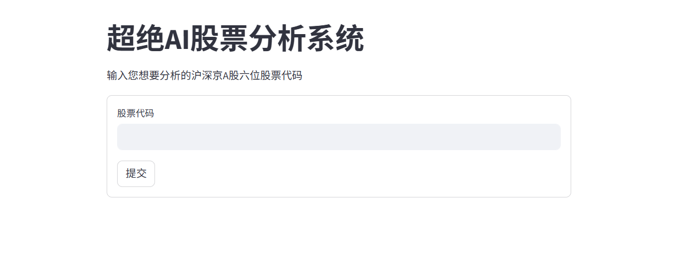

# StockOperatorAgent - 多智能体交易决策系统

---

## 安装

请确保你已经安装了Python 3.13或更高版本。然后，克隆此仓库并安装所需的依赖项，推荐使用venv：

```bash
git clone https://github.com/IIIIIIIIll/StockOperatorAgent.git
pip install -r requirements.txt
```

## 使用

1. **配置API密钥**：在`.env`文件中设置你的阿里云千问密钥，获取具体步骤请参考[阿里云官网](https://bailian.console.aliyun.com/?spm=5176.29597918.J_SEsSjsNv72yRuRFS2VknO.2.53477b08ZGAW8r&tab=api#/api)。可将密钥填入本地.env.example文件将其重命名为.env。
   2. ~~支持9988.HK喵 支持9988.HK谢谢喵 2025年底目标价格250HKD喵~~
2. 运行主程序：

```bash
 streamlit run main.py
``` 

3. 在浏览器中打开`http://localhost:8501`，即可使用StockOperatorAgent进行多模态交易决策。



## 功能

1. 基于真实市场数据，提供基本面与趋势分析报告
2. 支持多智能体协作决策
3. 提供可视化的交易决策界面

## 注意事项
- 请确保你的API密钥安全，不要泄露给他人。
- 由于数据出口限制，首次启动时数据可能需要超过10分钟才能加载完成，请耐心等待。
- 本项目仅供学习和研究使用，不构成任何投资建议。
