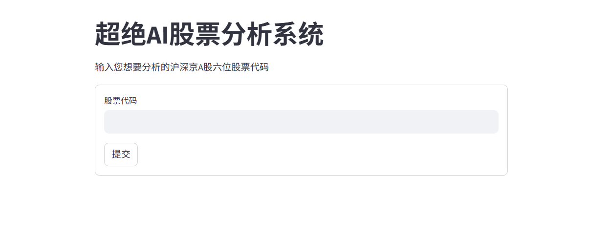

# StockOperatorAgent - 多智能体交易决策系统

---

## 安装

请确保你已经安装了Python 3.13或更高版本。然后，克隆此仓库并安装所需的依赖项，推荐使用venv：

```bash
git clone https://github.com/IIIIIIIIll/StockOperatorAgent.git
pip install -r requirements.txt
```

## 使用

1. **配置 LLM**：在`.env`文件中设置三个必填键（OpenAI 兼容，任意供应商，08-09 起不再绑定 DeepSeek）——`LLM_API_KEY`（API Key）、`LLM_MODEL`（模型名，如 `deepseek-v4-flash`、`gpt-4o`）、`LLM_BASE_URL`（endpoint，如 DeepSeek 官方 `https://api.deepseek.com`、OpenCode Zen 网关 `https://opencode.ai/zen/go/v1`、本地 vLLM/Ollama 网关）。可选 `LLM_REASONING_EFFORT=max` 透传推理档（仅支持的供应商设）。可复制 `.env.example` 为 `.env` 后填入（各键用途与开关语义见文件内注释；**08-09 迁移**：旧 `DEEPSEEK_API_KEY` / `DEEPSEEK_MODEL` / `DEEPSEEK_BASE_URL` 已移除，分别映射到上述三键；`DASHSCOPE_API_KEY` 已删除）。
   - 可选：设置 `TDX_API_KEY`（通达信 MCP）启用实时市场情报（概念板块/资金流/大盘概况）注入 agent 决策。未配置时应用正常降级运行，仅跳过实时情报；`TDX_MCP_DISABLED` 可显式关闭该能力（不查 MCP、不读写缓存）。
   - 可选：设置 `BILLIONS_API_KEY`（亿信 Fin 开放平台）启用公告/研报/新闻/推特检索与自然语言金融问数（信息面分析师报告 Tab + agent 工具）。未配置时亿信全部能力关闭、现有流程零变化（信息面分析师自动经免费联网搜索 DuckDuckGo 兜底，见「数据源」节）；`BILLIONS_*_DISABLED` 可独立关闭各能力，`BILLIONS_*_MAX_CALLS` 限制每次分析的调用上限（见 `.env.example`）。
   - 可选：`LANGSMITH_TRACING=true` + `LANGSMITH_API_KEY` + `LANGSMITH_PROJECT` 开启 LangSmith 追踪（每次 LLM 调用上报 token/延迟/prompt/response）。
   - 所有密钥与能力开关也可在网页**侧边栏「设置」面板**修改：保存即写入 `.env` 并立即生效（无需重启），能力开关为会话级即时切换。
2. 运行主程序：

```bash
 streamlit run main.py
``` 

3. 在浏览器中打开`http://localhost:8501`，即可使用StockOperatorAgent进行多模态交易决策。



## 功能

1. 基于真实市场数据，提供基本面、趋势、技术指标与信息面分析报告
2. 支持多智能体协作决策（专家初稿 → 多空对抗修订 → 投资经理终审）
3. 提供可视化的交易决策界面（报告 Tab、采集数据表格与图表、暗色主题）
4. 侧边栏设置面板：模型/密钥/能力开关/亿信调用上限全部可在网页修改

## 数据源

- **主链路（纯 TDX/pytdx）**：`data_source/chinese_mainland/tdx/` 薄包装
  vendored [tdx_quant](https://github.com/henrylin99/tdx_quant)（pytdx 直连通达信
  行情服务器，快且稳定）。历史行情（前复权 qfq）、**个股概览**（行情/股本/行业/
  估值与市值派生/涨跌幅）与**业绩报告**（F10 派生 + 环比自算）全部由 TDX 提供。
  个股数据**按需单股构建**（分析哪只构建哪只，不做全市场行情扫描）。更新 vendor
  的方式见 `data_source/chinese_mainland/tdx/vendor/VENDOR.md`。
- **akshare**：备用路径，主流程（纯 TDX 链路）不再调用（原方法保留，不自动
  接管主流程）。BJ 代码（4/8 前缀）TDX 全链路不可用（无名称/无行情），UI 输入
  BJ 代码会明确提示不支持而非静默 NaN（也不走 akshare 自动兜底）。
- **亿信 Fin（可选）**：`data_source/chinese_mainland/billions/` REST 薄包装——
  公告/研报/新闻/推特检索（信息面分析师预抓 + agent 的 LLM 工具）+ 自然语言
  金融问数（采集数据的「亿信金融数据库」段）。`BILLIONS_API_KEY` 为主闸，未配置
  时全部关闭、流程零变化；信息面分析师自动回退免费联网搜索（DuckDuckGo，免
  key）预抓素材——亿信优先、联网兜底，双失败才产出「未检索到素材」占位报告
  （web 端经同源 `/web-search` 代理，2026-08-10）。
- **字段缺失语义**：pytdx 无数据的字段（量比/5分钟涨跌/动量/毛利率等）输出 NaN，
  不报错；名称索引拉取失败时回退股票代码。

## 注意事项
- 请确保你的API密钥安全，不要泄露给他人。
- 由于数据出口限制，首次启动时数据可能需要超过10分钟才能加载完成，请耐心等待。
- 本项目仅供学习和研究使用，不构成任何投资建议。
